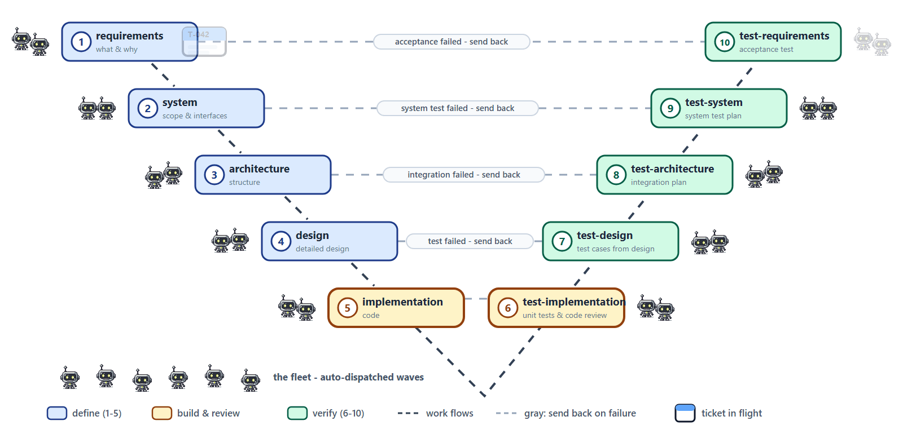

# 🔱 Hephaestus

[](https://github.com/McNopper/Hephaestus/actions/workflows/verify.yml)

> **Early stage + token warning.** This is early-stage software - expect rough
> edges and rapid change. It also **burns tokens**: the fleet engine spawns
> real agent sessions per dispatched ticket (a worker run, and a reviewer pass
> per merged ticket when autonomous acceptance is on), and long waves multiply
> that fast. The fleet is therefore **disabled by default** - arm it
> deliberately (Fleet view -> Enable in Eclipse, or `"disabled": false` on the
> `fleet` server in `opencode.json` for TUI sessions), keep the concurrency and cost budgets
> set, and use the ticket `model` field as the cost lever (small,
> well-specified tickets deserve cheap models). Dispatch by hand where you
> can; let the fleet run only what pays for itself.

## About this document
- **Kind:** `doc` / repo README (top-level entry point)
- **Read by:** humans evaluating/adopting the template; **written by:** maintainers
- **Related:** pairs with `AGENTS.md` (workflow conventions) and the skill/agent set under `.opencode/`

> *[Hephaestus](https://en.wikipedia.org/wiki/Hephaestus) — Greek god of the forge, and the one who built automatons: Talos, the golden mechanical attendants.*



*What you see: the ten-stage V-model - the blue **definition leg (1-5)** steps down,
the amber **build/review vertex (5-6)** joins them, the green **verification leg (6-10)**
climbs back up. **One ticket** walks the whole V while **agent crews** (the mascots)
appear and disappear where the work is; a six-bot **fleet** waits at the bottom to
dispatch the next wave. The dashed connectors march in the direction of travel, and
the gray lines are the **send-back paths** (the pair lines name the failing
check, e.g. "system test failed - send back"; the legend keys the gray
dashes - rejection at the vertex included). The same flow drives the
Eclipse Board's
V-pipeline and the fleet's waves.*

## Overview

Hephaestus is an **opencode-native** template for **agentic project management and
software development**. It is organized by **domain** (not by a lifecycle or folder
tree): skills and agents are flat under `.opencode/` and named `<domain>-<descriptor>`.
Project management is a concrete, Scrum-like **ticket/sprint** workflow over the
**task store** (`.opencode/tasks/`, one Markdown file per ticket) served as `task_*`
MCP tools by the Eclipse harness's `eclipse-build` endpoint and the stdio
`tasks-tools` launcher (opencode prefixes them with the server name — `tasks_task_*`
in TUI sessions, `eclipse-build_task_*` in Eclipse; the tool/wire names stay `task_*`);
the **fleet** is dispatchable from chat itself via the `fleet` stdio server
(wire names `fleet_dispatch`/`fleet_jobs`/…, surfaced as `fleet_fleet_*` — chat is the
primary interface, Board buttons are conveniences); C++ and graphics are first-class **tools** (an agent and an
MCP server), not a separate lifecycle.

Three ideas hold it together:

- **Domains in names, not folders.** opencode discovers every `SKILL.md` under
  `.opencode/skills/*/`. Naming convention `<domain>-<descriptor>`
  (`software-`, `test-software-`, `project-manager-`, `cpp-`, `graphics-`, `code-`,
  `research-`); coordination agents are
  unprefixed.
- **A concrete PM, not a metaphor.** The `project-manager` agent runs Scrum over tickets in the
  task store. Tickets carry a `role` (discipline), and workers **self-claim** by role
  (`task_claim`). Multiple independent **projects** coexist as subdirectories of the
  store. The store is version-controlled Markdown — the seam the Maven mojos
  (`opencode-tasks:sync`/`plan`) and the Eclipse Board view build on.
- **Model-neutral by default.** Agents reference a *tier*; the concrete model
  resolves from YOUR `opencode.json` default and agent frontmatter — **no
  model ids are committed** (contributors use different providers; set your
  own, resolve via `/models`).

> **The PM/ticket system is optional.** Any skill or agent can be used **directly** by a
> human (or another agent) with no ticket or sprint — just invoke the skill or pick an
> agent with `/agents`. The PM system is there when you want tracked, multi-agent, sprint
> execution; skip it for ad-hoc work. Skills like `project-manager-doc-about` also work standalone,
> independent of PM.

## What works with and without Eclipse

Everything here is **opencode-native first**: the *entire* agentic stack — board,
fleet, skills, agents — runs from a plain `opencode` TUI in this repository.
Eclipse is the optional human surface: overview, inspection, takeover. One
repository, two ways to use it:

| Capability | Plain opencode TUI (no Eclipse) | Eclipse harness (on top) |
|---|---|---|
| Skills, agents, model tiers (`/agents`, `/models`, Plan mode) | ✅ | ✅ — same engine, surfaced in views |
| **Task board** — `task_*` tools incl. `task_doctor` lint, V-pipeline, sprints | ✅ `tasks` stdio server (`eclipse/tasks-tools.ps1`) | ✅ **Board view** (kanban + pipeline, type badges, peer-write refresh) *and* the same tools via `eclipse-build` |
| **Fleet** — dispatch, jobs, live progress, permissions, store sync, auto-dispatch (`fleet_*`) | ✅ `fleet` stdio server (`eclipse/fleet-tools.ps1`; **disabled by default** — enable in `opencode.json`) | ✅ **Fleet view** (own *and peer-engine* jobs, diffs, permissions) |
| **Maven mojos** `opencode-tasks:sync` / `:plan` over the store | ✅ | ✅ |
| Graphics MCP (screenshot, RenderDoc, render comparison) | ✅ | ✅ |
| `cpp-tools` agent driving CMake/clang tooling | ✅ (bash-driven) | ✅ |
| Structured C++ tool pack as MCP tools (`cmake_*`, `ctest_run`, `debug_batch`, …) | ❌ lives in Eclipse's `eclipse-build` endpoint | ✅ (per-start token auth) |
| Chat UI (markdown/KaTeX/mermaid, Stop, pending queue, late-reply recovery) | — the TUI *is* your chat | ✅ chat view |
| Server/Providers/Repo/Session views, live busy-session icons, CDT markers | ❌ | ✅ |
| Building this harness itself | `eclipse/build.ps1` (JDK 21, Maven/Tycho reactor) | same |

The split is deliberate architecture, not happenstance: the `client`, `tools`,
`tasks`, `git` and `fleet` bundles are **platform-free (UI/runtime)** — with one
deliberate exception: the Eclipse **JobManager** runtime (`org.eclipse.core.jobs` +
`equinox.common`) is allowed because both run in a plain JVM, and the engine uses the
same work scheduler (`WorkerPools`) in every host — the IDE
consumes them, never owns them (see `eclipse/ARCHITECTURE.md`).

## With or without the fleet

The harness works **with and without the fleet**.

- **Without the fleet (default):** you trigger every step yourself - via
  **chat** or the **Eclipse UI** (Board, *Launch task*). No fleet needed
  anywhere, Eclipse included.
- **With the fleet:** the same steps run **automated** - unattended waves
  claim, run, merge and accept on their own, inside the cost/concurrency
  budgets. That is the **token burner** from the warning above, so the fleet
  is **disabled by default**: enable it deliberately (Fleet view -> *Enable*,
  or `"disabled": false` on the `fleet` server in `opencode.json`) and keep
  the budgets set.

## Layout

| Path | What it is |
|---|---|
| `opencode.json` (repo root) | project config - your `model` (set locally; none is committed), `AGENTS.md`, and the `tasks` + `fleet` (stdio launchers; `fleet` ships **disabled**) + `graphics` MCP servers. |
| `AGENTS.md` (repo root) | opencode-first workflow conventions and routing. |
| `.opencode/skills/*/SKILL.md` | the skill library, flat by domain. |
| `.opencode/agent/*.md` | lean custom agents (coordination + domain). |
| `.opencode/docs/` | `domains.md`, `contracts.md`. |
| `.opencode/tasks/` | the **task store** — one Markdown file per ticket per project (`<project>/T-NNN.md` + `_meta.json` sidecar), version-controlled. |
| `mcp/graphics/` | the graphics MCP server (captures, comparisons). |
| `cpp/` | standalone AI-first C++23 build skeleton (its own `AGENTS.md`). |
| `eclipse/` | the Eclipse plugin — the agentic IDE harness (chat, Server view incl. **MCP servers + Skills**, Providers view with logos, the **PM Board + Fleet views**, the token-authed `eclipse-build` MCP endpoint serving the C++ **and** `task_*` tool packs, git-worktree fleet incl. the task-driven `TaskFleet`, the `opencode-tasks` Maven plugin (`:sync`/`:plan` over the task store), the `tasks-tools.ps1`/`fleet-tools.ps1` stdio launchers; Maven/Tycho reactor). |

## Skills (flat, by domain)

| Domain | Skills |
|---|---|
| `software-` (definition) | `software-requirements`, `software-system`, `software-architecture`, `software-design`, `software-implementation` |
| `test-software-` (verification) | `test-software-implementation`, `-design`, `-architecture`, `-system`, `-requirements` |
| `project-manager-` (project management) | `project-manager-operating-model`, `project-manager-orchestrate-execution`, `project-manager-route-request`, `project-manager-audit-traceability`, `project-manager-estimate-costs`, `project-manager-gather-intelligence`, `project-manager-create-ticket`, `project-manager-doc-about` |
| `cpp-` (C++ utility) | `cpp-tools` (methodology; the `cpp-tools` agent runs the commands) |
| `graphics-` (graphics utility) | `graphics-render-comparison` (the heavy lifting is the `mcp.graphics` tools) |
| `code-` (code analysis) | `code-dependency` (package/namespace dependency map → Mermaid block diagram), `code-licenses` (third-party license audit → compatibility table + remediation), `code-repo-map` (probe-don't-read orientation map: layout, build/test entry points, module one-liners) |
| `research-` (live research utility) | `research-artificial-analysis-models` (Artificial Analysis model leaderboard → filtered, cost-sorted Markdown table) |

Verification maps by composition level: `test-software-implementation` ↔ `software-implementation`
(unit), `test-software-design` ↔ `software-design` (component), `test-software-architecture`
↔ `software-architecture` (library), `test-software-system` ↔ `software-system` (integration),
`test-software-requirements` ↔ `software-requirements` (acceptance).

### Terminology (canonical in this repo)

The dividing line between **component** and **library** is **reuse scope**, not size and
not static-vs-shared linkage (that is a build decision):

| Term | Meaning | Reuse scope | Composes into |
|---|---|---|---|
| **Unit** | Smallest element with a clear interface; implementation fills its content. | within one component | Component |
| **Component** | Units behind a clear interface; **internal** to this software. | within this software | Library |
| **Library** | Components behind a clear interface; **reusable outside this software**. | reusable across systems | Software System |
| **Software System** | Integrated product of libraries + external interfaces. | the deliverable | — |
| **Package/Folder** | Organization only; a language *module* is also just organization. | — | — |

## The ticket / sprint workflow

The **task store** (`.opencode/tasks/<project>/`, one Markdown file per ticket) holds
**tickets** and **sprints**, scoped per **project** so several independent projects run at
once. Agents read/write it through the `task_*` MCP tools; humans can read the files
directly (and hand edits are tolerated between tool writes). Ticket states:

```
product-backlog --plan--> sprint-backlog --claim--> in-progress --verify--> in-review --accept--> done
   (incomplete on sprint close ───────────────────────────────────────────────────────────────┘)
paused = parked for maintenance (U-038): visible, never blocked; resume is a status update
blocked = orthogonal flag (blocked:bool + blocker:str) at any active state
```

Key rules:

- **Self-claim by role.** A worker loops `task_claim(role=…)`; the call is atomic (file
  lock + temp-rename writes) so two agents never get the same ticket. A returned ticket
  (`task_release`) can be picked up by a *different* agent. A claim with nothing to do
  returns `null` — worker loops stop on it.
- **Record artifacts.** When a worker produces a file, git commit/branch, or doc, it
  records it with `task_add_artifact(kind=file|git|path|url|doc, ref=…)` *before* moving to
  `in-review` — the ticket is the hand-off contract.
- **Rework loop.** A review FAIL routes by stage: `task_send_back` to the previous
  stage's backlog, blocked with the reviewer's reasons (the human-escalation signal);
  first-stage and unstaged tickets have nowhere to send back to and are blocked in place.
  An UNCLEAR verdict round-trips the doubt to the originator (one retry per stage visit).
- **Bubble-up → escalation.** A blocked worker sets `blocked` + a `blocker`; the PM resolves
  internally or escalates only human-worthy decisions.

**V pipeline (optional, per ticket).** A ticket may carry a `stage` — the 10 canonical stages
`requirements` … `test-requirements` (definition down the left leg, verification up the right).
Stages run **concurrently** (no phase gates): each finished stage feeds the next stage's backlog
via `task_advance` (which re-derives role/skill from the new stage); a stage that cannot proceed
calls `task_send_back` with a reason. The Board view has a Pipeline mode for stage-ordered columns.

See `project-manager-operating-model` (Scrum events, DoD, escalation), `project-manager-create-ticket` (how to fill
a ticket), `project-manager-route-request` (ambiguous next step), `project-manager-audit-traceability` (matrix).

## Agents (lean, flat, model-neutral except one)

| Agent | Role | Model |
|---|---|---|
| `orchestrator` | kicks off the sprint; workers self-claim | tier (`high`) |
| `manifest-author` | high-tier plan + execution manifest | tier (`high`) |
| `executor` | open-tier task execution; records artifacts | tier (`low`) |
| `reviewer` | high-tier final review (edit-denied) | tier (`high`) |
| `rubberduck` | cross-vendor critic (edit-denied) | tier (different vendor) |
| `research` | authoritative-source investigation; validated synthesis | tier (`high`) |
| `project-manager` | Scrum Master + PO proxy; always present | tier (`high`) |
| `cpp-tools` | C++ build/format/static-analysis via bash | tier (`low`) |
| `graphics-expert` | frontier graphics work; drives `mcp.graphics` | **pinned `very-high`** |

## C++ and graphics

- **C++**: the `cpp-tools` *agent* runs CMake configure/build, clang-format, cppcheck,
  clang-tidy and reads their reports (methodology in the `cpp-tools` skill); there is
  no separate C++ MCP server (the structured C++ tool pack ships in the
  `eclipse-build` endpoint — see the table above).
- **Graphics**: `mcp.graphics` exposes `graphics_screenshot`, `graphics_renderdoc_capture`,
  `graphics_renderdoc_frame`, `graphics_compare_renders`. `graphics-expert` (very-high tier) drives
  them; `graphics-render-comparison` is the thin methodology skill.

## Model tiers

Agents/docs reference **tiers**, never hard-coded model IDs, and **no model
ids are committed** (decision D-004: contributors use different providers) —
each setup configures its `opencode.json` default and agent frontmatter, and
resolves tiers through `/models`. In the Eclipse chat, selector changes
are deliberate by design: un-armed drift (mouse-wheel/pointer traffic over the
selector row) reverts — only an opened-dropdown pick or Enter commits.

| Tier | Selection rule |
|---|---|
| `very-low` | cheapest/fastest for trivial, mechanical edits |
| `low` | best open-weight model — **default executor** |
| `mid` | balanced general model for standard impl/tests |
| `high` | top-capability reasoning + large context — planning + review |
| `very-high` | frontier/highest-risk — run twice & reconcile |

## Recommended opencode workflow

1. **Frame the project:** the human writes the brief/goal; the `project-manager` agent creates tickets
   (`task_create`) in `product-backlog`.
2. **Sprint planning:** `task_plan_sprint` commits tickets to a sprint (`sprint-backlog`).
3. **Execute:** workers `task_claim(role=…)`, use the matching `software-*` /
   `test-software-*` skill, record artifacts, and move tickets to `in-review`.
4. **Review & accept:** the `reviewer` / test skills verify; acceptance is the
   **engine's review pass** — after a merged launch the fleet dispatches a read-only
   review session and applies its verdict (U-021): PASS → `done` (and advance into the
   next stage's backlog), FAIL → staged send-back, UNCLEAR → stays `in-review` for the
   human. The human's regular duty is resolving NEEDS-HUMAN escalations and accepting
   at Sprint Review.
5. **Iterate:** defects rework; `task_close_sprint` returns unfinished tickets to the backlog.

Use **Plan mode** (`Tab`) for multi-file changes; `/agents` to pick an agent; `/models` to
resolve a tier; the `orchestrator` dispatches parallel subagents. Skills auto-load from
`.opencode/skills/`; reference files with `@`.

## Install & Use (opencode)

1. [Install opencode v2](https://opencode.ai/v2/docs/) — `npm install -g @opencode/cli`
   (the old `opencode-ai` package is the v1 line).
2. **PowerShell 7 (`pwsh`) on PATH** — `opencode.json` launches the bundled MCP
   servers through `pwsh`, and the launchers use PowerShell 7 syntax.
3. Connect providers via `/connect` (e.g. Z.AI, GitHub Copilot, OpenAI —
   whichever you use).
4. Install the graphics MCP deps: `pip install -r mcp/graphics/requirements.txt`.
5. Build the tool jars once (JDK 21): `cd eclipse; .\build.ps1 clean verify` —
   the **full reactor**; isolated `-pl` builds fail Tycho resolution of the
   sibling SNAPSHOT bundles unless you add `-am`. One build also fills the local
   Tycho p2 cache the stdio launchers resolve gson (and the JobManager jars)
   from.
6. Run `opencode` from this repo. Skills, agents, and `AGENTS.md` auto-load; the
   `tasks` stdio launcher and the `graphics` MCP server start from `opencode.json`.
   The `fleet` stdio server is registered but **disabled by default**
   (`"disabled": true` in `opencode.json`) — enable it by setting that to
   `"false"`, or reconnect at runtime with
   `POST /api/experimental/mcp/fleet/connect?location[directory]=<repo>`.
7. Your first headless fleet dispatch: see **`docs/fleet-quickstart.md`** (seed
   ticket → `fleet_dispatch` → poll → merge → actuals — the whole engine works
   without Eclipse). Host discipline for the automatic pump (auto-dispatch /
   recurring waves): it runs in **whichever host starts it** — the Eclipse Board,
   or the fleet stdio JVM when a chat session calls `fleet_auto_start` /
   `fleet_waves_start` — and pumps for as long as that host runs. There is no
   detached fleet daemon and no third host.

> **MCP scope:** the bundled servers implement a deliberately minimal JSON-RPC surface
> (`initialize`, `tools/list`, `tools/call`, plus `ping` on all three Java servers —
> `tasks`, `fleet` and `eclipse-build` share one dispatcher). The `tasks` and `fleet`
> launchers (Java, stdio) and the Eclipse-hosted `eclipse-build` endpoint (Streamable
> HTTP, serving the `task_*` **and** C++ tool packs) expose their tool sets over the
> same surface — one surface, two transports; `graphics` is stdio. None implement
> `resources`, `prompts`, cancellation, or progress. That is sufficient for opencode
> tool calls.

> **No plugin sources ship.** `.opencode/` carries only skills, agents, docs and
> the task store — there is no `package.json` and no `node_modules` under it;
> a fresh clone needs no `npm install` there. The harness integrates with
> opencode via MCP servers, skills and agents, not Node plugins.

### Reuse as a template

Hephaestus is a **template repo**. Copy the pieces you need (below), then
follow **[`docs/own-project.md`](docs/own-project.md)** - the step-by-step
guide for wiring the harness to YOUR project (store layout, config,
tickets, waves, verification gate, and what to replace in the template):

```bash
# from your project root
mkdir -p .opencode/skills .opencode/agent mcp
cp -R /path/to/Hephaestus/.opencode/skills/* .opencode/skills/
cp -R /path/to/Hephaestus/.opencode/agent/*  .opencode/agent/
cp -R /path/to/Hephaestus/mcp/graphics       mcp/
cp    /path/to/Hephaestus/opencode.json .
cp    /path/to/Hephaestus/AGENTS.md .
# task board: point opencode.json's "tasks" entry at the Hephaestus
# CHECKOUT's launcher (absolute path) — do NOT copy tasks-tools.ps1 into your
# repo: it resolves the built jars relative to itself (falling back to this
# repo's git common-dir for worktrees); a copy in a foreign repo finds no jars.
# -Root defaults to .opencode/tasks under the directory opencode runs in.
```

Trim to what you need (e.g. drop `graphics-*` / `mcp.graphics` if unused). Set the
default `model` in `opencode.json` (and any per-agent overrides) to match your
providers.

### What *not* to do

- ❌ Don't commit a model id anywhere (`opencode.json` default or agent
  frontmatter) — reference a **tier**; every setup decides its providers.
- ❌ Don't rename `SKILL.md` or rely on the folder name — identity is the front-matter
  `name:` (must match its folder).
- ❌ Don't put two `AGENTS.md` in the same folder — opencode loads one per git-root/cwd.
- ⚠️ Skills in `.opencode/skills/` load for everyone who runs `opencode` here — commit only
  what the project needs.

## C++ build template

[`cpp/`](cpp/) is a standalone **AI-first C++23 build template** (its own `CMakeLists.txt`,
`CMakePresets.json`, `AGENTS.md`, `.clang-tidy`, `.clang-format`, `src/`, `include/`,
`tests/`). It emits machine-readable reports (compile DB, Doxygen XML, clang-tidy /
cppcheck exports) and runs `verify` (fast) and `verify-full` (strict). The `cpp-tools`
agent drives it. See [`cpp/README.md`](cpp/README.md) and [`cpp/AGENTS.md`](cpp/AGENTS.md).

Presets ship for the Ninja-first toolchains — `default`/`release`/`analysis`
(Ninja + Clang on PATH, full AI analysis stack), `clang64`/`mingw64` (MSYS2
environments), `linux` (Ninja + gcc, incl. WSL) — and **`windows`** (Visual Studio +
MSVC, which builds and tests but skips the Clang-based analysis by design). On a
Windows host without Clang/Ninja, use `cmake --preset windows`.

## License

[MIT](LICENSE) © 2026 Norbert Nopper.

### Third-party licenses

The bundled graphics MCP server depends on **Pillow** (HPND) and **numpy**
(BSD-3-Clause) — all permissive and compatible with MIT. Their
full license texts and copyright notices are in
[`THIRD-PARTY.md`](THIRD-PARTY.md). The `cpp/` template's test-only GoogleTest
(BSD-3-Clause, fetched on demand) is not redistributed and is documented there
as well. The Eclipse chat view additionally vendors **markdown-it**, **mermaid**,
**KaTeX**, and **highlight.js** into its bundle jar; their notices are also in
[`THIRD-PARTY.md`](THIRD-PARTY.md).
