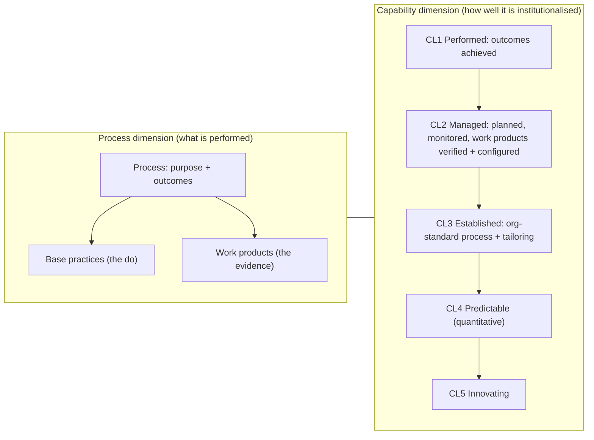

# SPICE/ASPICE alignment — the abstract process behind our workflow

## About this document
- **Kind:** `doc` / analysis: how the Hephaestus process model maps onto
  ISO/IEC 15504 (SPICE) and Automotive SPICE.
- **Read by:** anyone reasoning about the harness's process rules (the
  V-stages, verification pairs, blocked/clarification loops, effort
  tracking); **written by:** maintainers.
- **Related:** `AGENTS.md` (the living process definition), `ROADMAP.md`,
  `docs/opencode-v2-adoption.md`. Research grounded 2026-10-07 against the
  VDA QMC Automotive SPICE PAM 3.1, ISO/IEC 15504/33004/33020 material and
  the public pocket guides (sources at the end).

## The abstract process, in one view

SPICE assesses a process on **two dimensions**:

- Every process states a **purpose and outcomes**; **base practices**
  achieve them; **work products** are the evidence an assessor accepts.
- Capability is rated per **process attribute** on the NPLF scale
  (Not/Partially/Largely/Fully achieved), and the result is a **process
  profile** per process plus a capability level (0…5).
- The loop processes are explicit: **problem resolution** and **change
  request management** (SUP.9/SUP.10; SWE.9/SWE.10 in ASPICE) and
  **measurement** (MAN.6) — plan, do, check, act with data.

ASPICE (Automotive SPICE, VDA) is the automotive derivation: a process
reference model with primary (SYS/SWE/HWE/VAL/REU), supporting
(QA, CM, problem resolution, change request) and organizational
(MAN/PIM/ACQ) processes; suppliers are usually contracted at **CL2 or CL3**.

## The mapping — our harness IS a process assessment model in motion

| SPICE/ASPICE concept | Hephaestus equivalent |
|---|---|
| Process reference model (purpose/outcomes) | `AGENTS.md` + the `project-manager-*` / `software-*` skills: the written process every agent loads |
| SWE.1–SWE.4 (requirements → architecture → design → coding) | the definition leg: `requirements` → `system` → `architecture` → `design` → `implementation` |
| SWE.5–SWE.8 / VAL (verification & validation at each level) | the verification leg: `test-implementation` … `test-requirements` — the **horizontal reporting line** |
| V-model (level-matched validation) | the two flows in AGENTS.md: **along the V** (advance / send-back) and **horizontal for validation** (paired `test-X` ↔ `X`) |
| Base practices + work products (evidence) | the ticket's execution: dispatch → work → review pass; artifacts recorded via `task_add_artifact` are the **work products/records** |
| SUP.9/SUP.10 problem & change request | **blocked → back to origin**: `task_send_back` / clarification round-trips (U-023), a new requirement upstream answers the implementation question |
| MAN.6 measurement | `fleet actuals:` (cost/tokens per run) + readiness/traceability verdicts = the effort record; this is why results/artifacts live ON the ticket |
| CL1 Performed | a ticket whose stage work + review pass actually happened (gate green, verdict PASS) |
| CL2 Managed | a wave: planned (`task_plan_sprint`), monitored (readiness, budgets, watchdog), work products verified (review) and configured (git + task store) |
| CL3 Established | the repo itself: the standard process is defined, versioned and load-bearing (skills/agents), tailoring = role/stage maps per ticket |
| CL4/CL5 | out of scope for now; the actuals + history trail are the raw material for quantitative tuning |
| NPLF rating scale | precedent for a future *quality* verdict per ticket (today: PASS/FAIL/UNCLEAR + readiness kinds — a 4-point achievement scale is not needed yet) |
| Process profile (per-process ratings) | `task_traceability` + `task_readiness` + `task_doctor` together read as a live profile of the project's process state |

## What we deliberately adopt, and what we don't

**Adopted (already live):** outcome-oriented staging; evidence-as-work-product
(artifacts before `in-review`); horizontal validation pairs (U-070's three
signals); explicit problem-resolution loop (blocked → origin, clarify via
requirement); measurement as effort tracking (`fleet actuals:` + history);
a written standard process (AGENTS.md/skills) = CL3 intent.

**Deliberately not adopted:** assessor roles/rating bureaucracy (NPLF
percentages, attribute scoring) — the harness automates the *evidence*
side so a human rates by exception (NEEDS-HUMAN), not by forms; formal
tailoring templates — role/stage maps serve that purpose at ticket scale.

## Sources

- ISO/IEC 15504-2:2003 (performing an assessment; two-dimensional model),
  ISO/IEC 15504-5:2012 (process assessment model: base practices, generic
  practices, work products).
- ISO/IEC 33004/33020 (capability levels, process attributes) — the family
  ASPICE 3.1/4.0 references.
- VDA QMC, *Automotive SPICE PAM 3.1* (2017) and the Automotive SPICE
  Pocket Guide (4.0); process categories, CL0–CL5, NPLF scale.
- Vendor overviews used for cross-checking the level definitions
  (MathWorks, Perforce, itemis, LDRA, JAMA — all agree on CL0–CL5 wording).
